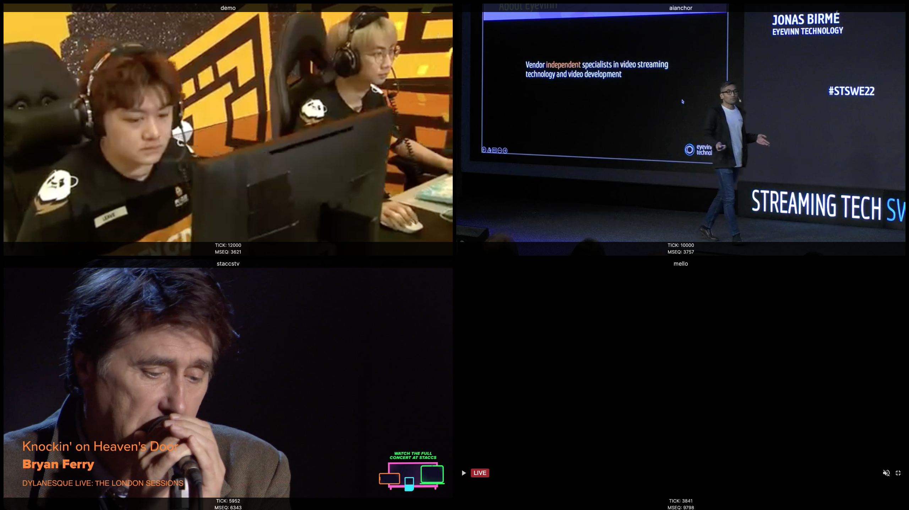

<h1 align="center">
  Eyevinn Channel Engine Mosaic
</h1>

<div align="center">
  Visually monitor Eyevinn Channel Engine channels
  <br />
  <br />
  :book: <b><a href="https://vod2live.docs.eyevinn.technology">Read the documentation</a></b> :eyes:
  <br />
</div>

<div align="center">
<br />

[](https://github.com/Eyevinn/channel-engine-mosaic/releases)
[](LICENSE)

[](https://github.com/eyevinn/channel-engine-mosaic/issues?q=is%3Aissue+is%3Aopen+label%3A%22help+wanted%22)
[](https://github.com/eyevinn)
[](http://slack.streamingtech.se)

</div>

A web application that provides a multiviewer (mosaic) for all channels provided by a VOD2Live engine based on [Eyevinn Channel Engine library](https://github.com/Eyevinn/channel-engine).



[Online version](https://vod2live.player.eyevinn.technology)

## Development

To start the application:

```
npm install
npm start
```

Open `http://localhost:1234` in your browser to open the multiview. Enter the URL to the Channel Engine, e.g. `https://fast.vc.eyevinn.technology`

Using eslint

```
npm run lint
```

## Contributing

See [CONTRIBUTING](CONTRIBUTING.md)

## License

This project is licensed under the MIT License, see [LICENSE](LICENSE).

# Support

Join our [community on Slack](http://slack.streamingtech.se) where you can post any questions regarding any of our open source projects. Eyevinn's consulting business can also offer you:

- Further development of this component
- Customization and integration of this component into your platform
- Support and maintenance agreement

Contact [sales@eyevinn.se](mailto:sales@eyevinn.se) if you are interested.

# About Eyevinn Technology

[Eyevinn Technology](https://www.eyevinntechnology.se) is an independent consultant firm specialized in video and streaming. Independent in a way that we are not commercially tied to any platform or technology vendor. As our way to innovate and push the industry forward we develop proof-of-concepts and tools. The things we learn and the code we write we share with the industry in [blogs](https://dev.to/video) and by open sourcing the code we have written.

Want to know more about Eyevinn and how it is to work here. Contact us at work@eyevinn.se!
